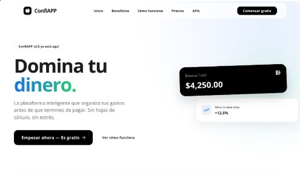

# 💸 Frontend Aprendices — Plataforma de Transacciones Financieras

<div align="center">
  
  
  ### Luz Karime Loaiza Muñoz
  **Tecnología en Análisis y Desarrollo de Software (ADSO) - SENA**

  
  
  
  
  
</div>
---

## 📝 Descripción

**Frontend Aprendices** es una aplicación web moderna de gestión de transacciones financieras personales, desarrollada como proyecto formativo en el SENA. Permite a los usuarios registrarse, iniciar sesión y administrar sus transacciones de forma clara e intuitiva.

Este proyecto es una **Aplicación de Página Única (SPA)** construida con **React + Vite**, que se comunica con una API REST a través de Axios. Su objetivo principal es permitir a los usuarios:

- 🔐 **Autenticarse** de forma segura con registro e inicio de sesión.
- 💳 **Gestionar transacciones** financieras (crear, listar, visualizar).
- 🎯 **Explorar beneficios y pasos** informativos de la plataforma.
- 📊 **Visualizar precios y planes** disponibles.

---

## ✨ Características Principales


| Característica                  | Descripción                                                                           |
| ------------------------------- | ------------------------------------------------------------------------------------- |
| 🔐 **Autenticación Completa**   | Registro e inicio de sesión con validación mediante `AuthContext`                     |
| 💳 **Gestión de Transacciones** | Listado, creación y visualización de transacciones con `transactionItem.jsx`          |
| 🌐 **Integración con API REST** | Comunicación con backend mediante Axios (`auth.service.js`, `transaction.service.js`) |
| 🧭 **Enrutamiento Protegido**   | Rutas privadas/públicas configuradas en `AppRoutes.jsx`                               |
| 🎨 **Portal de Acceso**         | Componente `portal.jsx` para la entrada principal al sistema                          |
| 📱 **Diseño Responsivo**        | Interfaz adaptable a distintos tamaños de pantalla con CSS modular                    |
| ⚡ **Build Optimizado**          | Configuración de Vite para alta velocidad en desarrollo y producción                  |


---

## 🎨 Interfaz Gráfica

### Paleta de Colores

```
Fondo principal:   #FFFFFF  (Blanco)
Fondo hero:        #EFF6FF  (Azul hielo suave)
Color acento 1:    #2563EB  (Azul eléctrico) ← texto destacado
Color acento 2:    #10B981  (Verde esmeralda) ← punto final del slogan
Tarjeta balance:   #111827  (Negro profundo)
Texto principal:   #111827  (Casi negro)
Texto secundario:  #6B7280  (Gris medio)
Botón CTA:         #111827  (Negro) con texto blanco
```

### Componentes Visuales Principales

- 📋 **TransactionForm** — Formulario para registrar nuevas transacciones.
- 🗂️ **TransactionList** — Listado de todas las transacciones del usuario.
- 🃏 **TransactionItem** — Tarjeta individual de cada transacción.
- 🚪 **Portal** — Pantalla de bienvenida y acceso al sistema.
- 💰 **Precios** — Vista de planes y precios disponibles.
- ✅ **Pasos** — Guía de pasos para usar la plataforma.
- 🎁 **Beneficios** — Sección con los beneficios del servicio.

---

## 🏗️ Arquitectura del Proyecto

```
FRONTEND-APRENDICES/
├── dist/                               # Build de producción generado por Vite
├── public/
│   ├── img/                            # Imágenes estáticas
│   │   ├── auww.png
|   │   ├── Perfil.jpeg
│   │   ├── favicon.svg
│   │   ├── hero.png
│   │   ├── icons.svg
│   │   ├── Logo1.0.ico
│   │   ├── mundo.jpeg
│   │   ├── penguin.png
│   │   ├── react.svg
│   │   ├── vite.svg
│   │   └── world.png
│   ├── robots.txt
│   └── sw.js                           # Service Worker (PWA)
│
├── src/
│   ├── features/
│   │   ├── auth/
│   │   │   ├── api/
│   │   │   │   └── axios.js            # Instancia configurada de Axios
│   │   │   ├── components/
│   │   │   │   ├── Myaccount.jsx       # Vista de cuenta del usuario
│   │   │   │   ├── portal.jsx          # Pantalla de acceso principal
│   │   │   │   ├── transactionForm.jsx # Formulario de transacciones
│   │   │   │   ├── transactionItem.jsx # Tarjeta individual de transacción
│   │   │   │   └── transactionList.jsx # Listado de transacciones
│   │   │   ├── context/
│   │   │   │   └── AuthContext.jsx     # Contexto global de autenticación
│   │   │   └── services/
│   │   │       ├── auth.service.js     # Servicios de autenticación (login, register)
│   │   │       └── transaction.service.js # Servicios de transacciones
│   │   │
│   │   ├── layout/
│   │   │   ├── Content.jsx             # Contenido principal de la app
│   │   │   ├── Footer.jsx              # Pie de página global
│   │   │   └── Header.jsx              # Encabezado y navegación global
│   │   │
│   │   └── view/
│   │       └── components/
│   │           ├── Beneficios.jsx      # Sección de beneficios
│   │           ├── Pasos.jsx           # Guía de pasos de uso
│   │           └── Precios.jsx         # Sección de precios/planes
│   │
│   ├── shared/
│   │   └── components/
│   │       ├── ApiRy.jsx               # Componente compartido de API
│   │       └── styles.css              # Estilos globales compartidos
│   │
│   ├── App.css                         # Estilos del componente raíz
│   ├── App.jsx                         # Componente raíz de la aplicación
│   ├── AppRoutes.jsx                   # Configuración de rutas
│   ├── index.css                       # Estilos globales base
│   └── main.jsx                        # Punto de entrada de la aplicación
│
├── .gitignore
├── eslint.config.js
├── index.html
├── package-lock.json
├── package.json
├── README.md
└── vite.config.js
```

---

## 🛠️ Stack Tecnológico


| Capa              | Tecnología                  | Versión   |
| ----------------- | --------------------------- | --------- |
| **Framework**     | React.js                    | 19.x      |
| **Build Tool**    | Vite                        | 6.x       |
| **UI Library**    | Material UI (MUI)           | 7.x       |
| **Estilos**       | Bootstrap + CSS3            | 5.x       |
| **Íconos**        | Bootstrap Icons + MUI Icons | 1.x / 7.x |
| **HTTP Client**   | Axios                       | 1.x       |
| **Enrutamiento**  | React Router DOM            | 7.x       |
| **Estado Global** | React Context API           | Built-in  |
| **PWA**           | vite-plugin-pwa             | 1.x       |
| **Linter**        | ESLint                      | 9.x       |


---

## 🚀 Instalación y Ejecución

Sigue estos pasos para ejecutar el proyecto localmente:

```bash
# 1. Clonar el repositorio
git clone https://github.com/TuUsuario/frontend-aprendices.git

# 2. Navegar al directorio del proyecto
cd frontend-aprendices

# 3. Instalar las dependencias
npm install

# 4. Iniciar el servidor de desarrollo
npm run dev
```

La aplicación estará disponible en **[http://localhost:5173](http://localhost:5173)** (o el puerto que indique Vite al iniciar).

---

## 📁 Scripts Disponibles


| Comando           | Descripción                                    |
| ----------------- | ---------------------------------------------- |
| `npm run dev`     | Inicia el servidor de desarrollo con HMR       |
| `npm run build`   | Genera el build de producción en `/dist`       |
| `npm run preview` | Previsualiza el build de producción localmente |
| `npm run lint`    | Ejecuta ESLint para revisar el código          |


---

## ⚙️ Variables de Entorno

Crea un archivo `.env` en la raíz del proyecto con las siguientes variables:

```env
VITE_API_URL=https://backend-transacciones.onrender.com/api
```

> ⚠️ **Importante:** Nunca subas tu archivo `.env` real a GitHub. Asegúrate de que esté incluido en el `.gitignore`.

### 🌐 URLs del Proyecto


| Entorno                       | URL                                                                                              |
| ----------------------------- | ------------------------------------------------------------------------------------------------ |
| 🖥️ **Frontend (Producción)** | [https://frotend-transacciones.vercel.app](https://frotend-transacciones.vercel.app)             |
| ⚙️ **Backend (Producción)**   | [https://backend-transacciones.onrender.com/api](https://backend-transacciones.onrender.com/api) |
| 🗄️ **Base de Datos**         | MongoDB Atlas — Cluster0 (Transacciones)                                                         |


---

## 👨‍💻 Datos del Autor


| Campo               | Información                                                |
| ------------------- | ---------------------------------------------------------- |
| 👤 **Nombre**       | Luz Karime Loaiza Muñoz                                    |
| 🏛️ **Institución** | SENA                                                       |
| 🎓 **Programa**     | Tecnología en Análisis y Desarrollo de Software            |
| 💼 **Rol**          | Desarrollador Frontend / UI Designer                       |
| 📧 **Correo**       | [Lkarimex27@gmail.com](mailto:Lkarimex27@gmail.com)        |
| 🐙 **GitHub**       | [@lkarimex27-dotcom](https://github.com/lkarimex27-dotcom) |


---

Hecho con ❤️ y dedicación durante la formación en el SENA 🎓

**Frontend Aprendices © 2026**